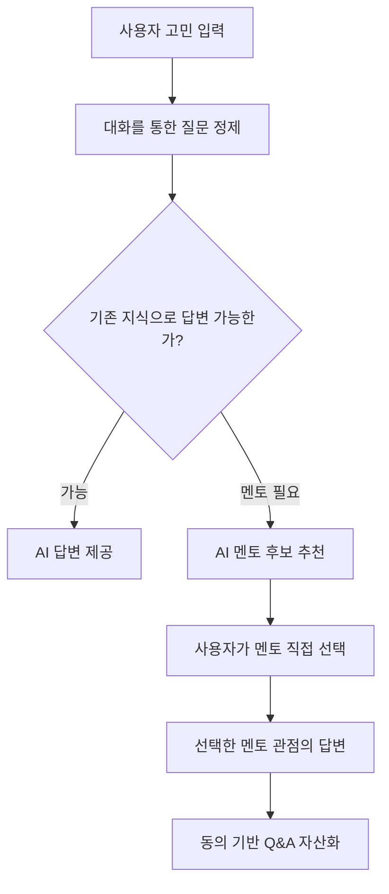

# M2M

> 막연한 커리어 고민을 구체적인 질문으로 바꾸고, AI 답변과 적합한 멘토 탐색을 돕는 웹서비스

M2M은 사용자의 고민을 대화를 통해 정제하고, 기존 커리어 지식으로 답할 수 있는지
판단한 뒤 필요한 경우 사용자가 직접 AI 멘토 페르소나를 선택하도록 돕습니다. 멘토
답변은 동의를 거쳐 Q&A 지식 자산으로 축적할 수 있도록 설계되어 있습니다.

## 프로젝트 구조

```text
M2M/
├── FE/                    # Next.js 16, TypeScript, Tailwind CSS
├── BE/                    # FastAPI, SQLAlchemy
├── M2M-mentoring-agent/   # 질문 정제·검색·멘토 추천·답변 Agent
└── data_db/               # 멘토 및 커리어 데이터
```

## 준비 사항

- Node.js 20 이상
- npm
- Conda
- Python 3.11
- OpenAI API 키 (실제 Agent 연동 시에만 필요)

## 최초 설치

저장소 루트에서 아래 명령을 실행합니다.

### 1. 백엔드 환경

```bash
conda create -n m2m-be python=3.11 -y
conda run -n m2m-be pip install -r BE/requirements.txt
cp BE/.env.example BE/.env
```

`BE/.env`에서 최소한 다음 값을 설정합니다.

```dotenv
OPENAI_API_KEY=your-openai-api-key
JWT_SECRET_KEY=replace-with-a-random-secret-at-least-32-characters
```

기본값인 `MENTORING_AGENT_MODE=auto`에서는 API 키가 없으면 비용 없는 데모 Agent로
상담 전체 흐름을 확인할 수 있습니다. 실제 Agent만 사용하려면 `live`, 항상 데모
데이터를 사용하려면 `demo`로 설정합니다.

### 2. 프론트엔드 환경

```bash
cd FE
npm install
cp .env.example .env.local
cd ..
```

기본 백엔드 주소는 `http://127.0.0.1:8000`입니다. 다른 주소를 사용할 때는
`FE/.env.local`의 `BACKEND_URL`을 변경합니다.

## 실행

터미널 두 개를 열어 백엔드와 프론트엔드를 각각 실행합니다.

터미널 1, 저장소 루트:

```bash
cd BE
conda run --no-capture-output -n m2m-be python -m uvicorn app.main:app --reload
```

터미널 2, 저장소 루트:

```bash
cd FE
npm run dev
```

실행 후 접속 주소:

- 웹서비스: http://localhost:3000
- 백엔드 상태: http://localhost:8000/health
- API 문서: http://localhost:8000/docs

## 현재 연동 범위

- 이메일 기반 멘티 회원가입·로그인·로그아웃
- HttpOnly 쿠키 기반 인증과 액세스 토큰 자동 갱신
- 이름, 현재 상태, 관심 분야 수정
- 이력서 PDF/DOCX와 포트폴리오 PDF/PPTX 업로드
- Q&A 목록·검색·상세·댓글 작성
- 상담 생성, 질문 정제·수정·확정, AI 멘토 선택과 답변 조회

멘토 회원가입 탭은 디자인에만 남겨두고 비활성화했습니다. Q&A 스크랩과 프로필
이미지 수정은 관련 API가 추가된 뒤 연결할 예정입니다.

## 검증

백엔드:

```bash
cd BE
conda run -n m2m-be pytest -q
conda run -n m2m-be ruff check app tests
```

프론트엔드:

```bash
cd FE
npm run lint
npm run build
```

## 핵심 흐름



세부 구현과 환경변수는 [FE/README.md](FE/README.md)와
[BE/README.md](BE/README.md)를 참고하세요.
