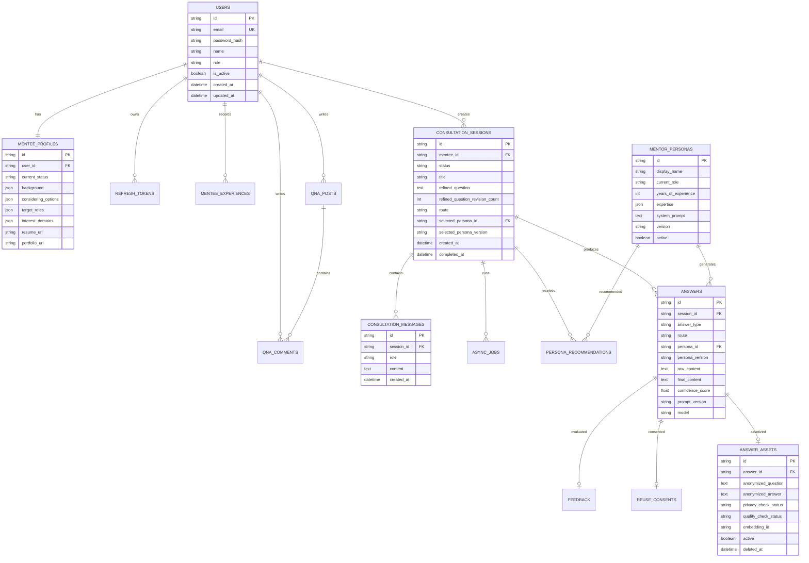

# M2M ERD v1.1 — 페르소나 멘토 구조

## 설계 원칙

- 로그인 사용자는 멘티뿐이다.
- 멘토 페르소나는 `users`와 분리된 내부 리소스다.
- 상담 원문과 재사용 자산을 분리한다.
- 답변에는 라우팅 결과, 페르소나·프롬프트·모델 버전을 기록한다.
- 재사용 동의를 철회하면 자산과 임베딩을 비활성화·삭제할 수 있어야 한다.

## 정제 질문 재생성 제약

`consultation_sessions.refined_question_revision_count`의 허용 범위는 `0..3`이다.

- 최초 생성: `0`
- AI 재생성 성공: `+1`
- 직접 수정: 증가하지 않음
- AI 호출 실패: 증가하지 않음
- `3`이면 재생성 API는 `409 REFINED_QUESTION_REVISION_LIMIT_EXCEEDED`

